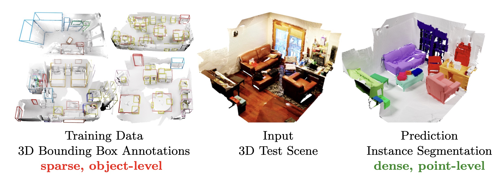

# Box2Mask

> [Julian Chibane](http://virtualhumans.mpi-inf.mpg.de/people/Chibane.html), 
> [Francis Engelmann](https://francisengelmann.github.io/),
> [Tuan Anh Tran](https://scholar.google.com/citations?user=5-0hLggAAAAJ&hl=en),
> [Gerard Pons-Moll](http://virtualhumans.mpi-inf.mpg.de/people/pons-moll.html) <br />
> Box2Mask: Weakly Supervised 3D Semantic Instance Segmentation Using Bounding Boxes <br />
> In European Conference on Computer Vision (ECCV), 2022



[Paper](http://virtualhumans.mpi-inf.mpg.de/papers/chibane22Box2Mask/Chibane_Box2Mask.pdf) - 
[Video](https://virtualhumans.mpi-inf.mpg.de/box2mask/#b2m_video) -
[Project Website](https://virtualhumans.mpi-inf.mpg.de/box2mask/) -
[Arxiv](https://arxiv.org/abs/2206.01203) -
[Citation (Bibtex)](https://virtualhumans.mpi-inf.mpg.de/box2mask/#cite)

## Installations

A linux system with python environment manager [conda](https://www.anaconda.com/) is required for the project.
Follow the instructions [here](docs/installation.md) to setup the environment

## Data Setup

**Scannet**: Download the [Scannet](http://www.scan-net.org/) dataset here. 
Download the preprocessed ground truth data ([gt_instance_data_txt.tar.gz](https://datasets.d2.mpi-inf.mpg.de/box2mask/gt_instance_data_txt.tar.gz)) and extract it to `data/scannet/`
Each scene is stored with the name of format `scene%04d_%02d` (see [Scannet](https://raw.githubusercontent.com/ScanNet/ScanNet/master/README.md)).
The data should be organized as follows for our project. 
```
box2mask/data/scannet/
└── scans/                        # contains 1513 train/valid scences
    ├── scene0383_02/             # each scene has the name in format `scene%04d_%02d`
        ├── scene0383_02_vh_clean.ply
        ├── scene0383_02.sens
        ├── scene0383_02_vh_clean_2.0.010000.segs.json
        ├── scene0383_02.aggregation.json, _vh_clean.aggregation.json
        ├── scene0383_02_vh_clean_2.0.010000.segs.json, _vh_clean.segs.json
        ├── scene0383_02_vh_clean_2.labels.ply
        ├── scene0383_02_2d-label.zip
        ├── scene0383_02_2d-instance.zip
        ├── scene0383_02_2d-label-filt.zip  
        ├── scene0383_02_2d-instance-filt.zip
    ├── scene0515_02/
    ├── scene0643_00/
    ...
└── scans_test/                   # contains 100 test scenes
    ├── scene0731_00/
        ├── scene0731_00.sens
        ├── scene0731_00.txt
        ├── scene0731_00_vh_clean_2.ply
        ├── scene0731_00_vh_clean.ply
    ├── scene0739_00/
    ├── scene0747_00/
    ...
└── scannetv2_official_split.npz  # contains data splits info
└── gt_instance_data_txt/         # contains GT segmentations as txt files
    ├── scene0383_02.txt
    ├── scene0643_00.txt
    ...
```

**Arkit**: See [Arkitscenes instruction](docs/arkitscenes.md).

**S3DIS**: See [S3DIS instruction](docs/s3dis.md).


## Quick Start with Pretrained Model

We provide a pretrained checkpoint for a quick start with the method.
First, from the folder where you clone the project, run the following command to download the pretrained checkpoint:
```bash
cd box2mask # Navigate to the root folder
mkdir -p experiments/scannet/checkpoints/
cd experiments/scannet/checkpoints/
wget https://datasets.d2.mpi-inf.mpg.de/box2mask/checkpoint_101h:54m:35s_366875.3242661953.tar
cd ../../../
```

Next, to predict a scene in the train set or test set, run the prediction from the project home folder:
```bash
python models/evaluation.py --config configs/scannet.txt --predict_specific_scene scene0293_00
```
where `--predict_specific_scene` specifies the name of the scene that will be processed. 
The result of the prediction is saved in `experiments/scannet/results/checkpoint_101h:54m:35s_366875.3242661953/viz/scene0293_00/` as `pred_instances.ply` and `pred_semantics.ply`.
To visualize the result using interactive web server, run:
```bash
cd experiments/scannet/results/checkpoint_101h:54m:35s_366875.3242661953/viz/scene0293_00/
python -m http.server 6008
```
and follow the on-screen instructions.

## Training

Start to train a model with a specific configuration file using:

```bash
python models/training.py --config configs/scannet.txt
```
The command above will train with the Scannet dataset.
You can use a different config file to train with a different dataset.
To train with the Arkitscenes dataset use `configs/arkitscenes.txt` or to train with the S3DIS dataset with area 1 as the validation set use `config/s3dis_fold1` (the data needs to be setup first, see Sec. 'Data Setup')
> Note: The above configuration uses a batch of 8 scenes, which assumes ~48GB GPURAM. 
> RAM usage can be decreased via a smaller batch size, see parameter `--batch_size`.

## Prediction and visualization

The following command makes a prediction for the validation set and computes the validation score (reproducing the results from table 1 in our paper).
```bash
python models/evaluation.py --config configs/scannet.txt --fixed_seed 10
```
To visualize the prediction for the validation set, add option `--produce_visualizations [scene_name]` to the above command, where `[scene_name]` is the name of the scene (eg. `scene0293_00` in Scannet or `6667847` in Arkitscenes or `Area_5.office_13` in S3DIS).
The visualization files will be stored in `./experiments/[config_name]/results/[checkpoint]/viz/` where  `[checkpoint]` is the name of the checkpoint used for prediction and `[config_name]` is the name of the config (`scannet` in this example).
The interactive visualization server can be started using the command bellow.
```bash
cd ./experiments/scannet/results/[checkpoint]
python -m http.server 6008
```
Follow the on-screen instructions to find the visualizations in your browser.


## Prediction on the ScanNet test set
The oversegmentations of scannet test scenes are needed for our project. Oversegmentations are already included for the train and validation scenes. 
For test scenes, see the [instruction](dataprocessing/oversegmentation/README.md) to compile the oversegmentation program.

Next, the following script will produce the oversegmentations for test scenes. The oversegmentations results will be stored at `./data/scannet/scans_test_segmented`
```bash
mkdirs -p ./data/scannet/scans_test_segmented
cd dataprocessing/oversegmentation/
python run_segmentator.py
```

To run the ScanNet evaluation on the test set, we need to add the parameter `--submission_write_out_testset`.
Without this parameter the validation set is evaluated as seen in the previous section.
```bash
python models/evaluation.py --config configs/scannet.txt --submission_write_out_testset --fixed_seed 100
```

Resulting predictions files will be stored in `./experiments/scannet/results/[checkpoint]`.
Our results are formatted into Scannet submission format ([see documentation](https://kaldir.vc.in.tum.de/scannet_benchmark/documentation)). 
`--fixed_seed` specifies a seed for test time augmentation.
Results can be visualized interactively, in the same fashion as shown in the previous section.
## Augmented Data

This [instruction](data/augmented_BBs/README.md) shows how to reproduce the augmented bounding box labels experiments and how to get the data.

## Arkitscenes Data

See [instruction](docs/arkitscenes.md) to reproduce the results of arkitscenes.

## S3DIS Data

See [instruction](docs/s3dis.md) to reproduce the results of S3DIS.

## Code structure

The code structure can be found [here](docs/code_structure.md).


## License
Copyright (c) 2022 Julian Chibane, Max-Planck-Gesellschaft

By using this code you agree to the terms in the LICENSE.

Moreover, you agree to cite the `Box2Mask: Weakly Supervised 3D Semantic Instance Segmentation Using Bounding Boxes` paper in 
any documents that report on research using this software or the manuscript.


<details>
  <summary> Show LICENSE (click to expand) </summary>
Please read carefully the following terms and conditions and any accompanying documentation before you download and/or use this software and associated documentation files (the "Software").

The authors hereby grant you a non-exclusive, non-transferable, free of charge right to copy, modify, merge, publish, distribute, and sublicense the Software for the sole purpose of performing non-commercial scientific research, non-commercial education, or non-commercial artistic projects.

Any other use, in particular any use for commercial purposes, is prohibited. This includes, without limitation, incorporation in a commercial product, use in a commercial service, or production of other artefacts for commercial purposes.
For commercial inquiries, please see above contact information.

THE SOFTWARE IS PROVIDED "AS IS", WITHOUT WARRANTY OF ANY KIND, EXPRESS OR IMPLIED, INCLUDING BUT NOT LIMITED TO THE WARRANTIES OF MERCHANTABILITY, FITNESS FOR A PARTICULAR PURPOSE AND NONINFRINGEMENT. IN NO EVENT SHALL THE AUTHORS OR COPYRIGHT HOLDERS BE LIABLE FOR ANY CLAIM, DAMAGES OR OTHER LIABILITY, WHETHER IN AN ACTION OF CONTRACT, TORT OR OTHERWISE, ARISING FROM, OUT OF OR IN CONNECTION WITH THE SOFTWARE OR THE USE OR OTHER DEALINGS IN THE SOFTWARE.

You understand and agree that the authors are under no obligation to provide either maintenance services, update services, notices of latent defects, or corrections of defects with regard to the Software. The authors nevertheless reserve the right to update, modify, or discontinue the Software at any time.

The above copyright notice and this permission notice shall be included in all copies or substantial portions of the Software.

</details>

