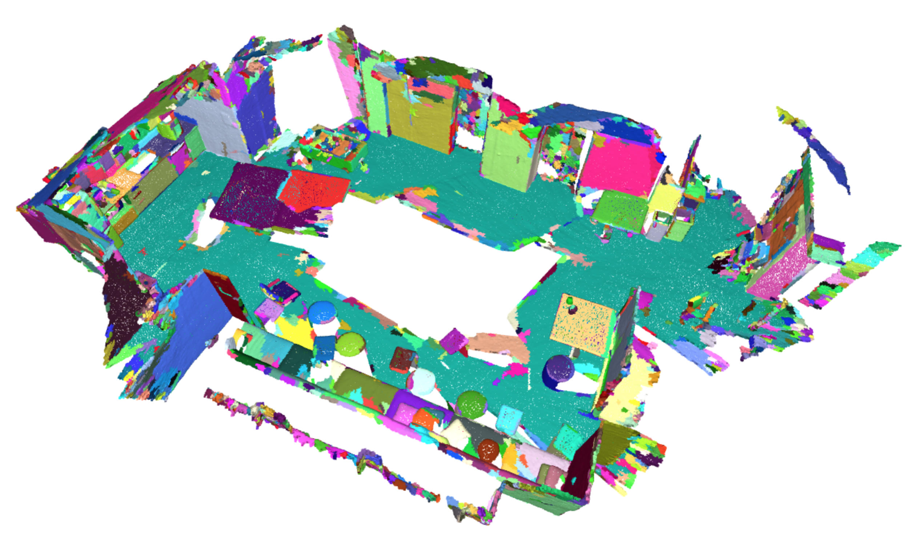

Mesh Segmentation
=================

Adapted from the original from the [ScaNet Github](https://github.com/ScanNet/ScanNet/tree/master/Segmentator).

Note that the segments for the validation scenes are already available the ``*.segs.json`` files.

# 1. Compile the segmentator

Mesh segmentation code using Felzenswalb and Huttenlocher's [*Graph Based Image Segmentation*](https://cs.brown.edu/~pff/segment/index.html) algorithm on computed mesh normals.

To compile the segmentator code, navigate to the segmentor directory:
```
cd box2mask/dataprocessing/oversegmentation/cpp
```
Set `CMAKE_SOURCE_DIR={path_to_project_director}/dataprocessing/oversegmentation/cpp` in `Makefile` where `{path_to_project_director}` is the path to the project home directory.

Build by running `make` (or create makefiles for your system using `cmake`). This will create a `segmentator` binary that can be called to generate segmentation:

To see if it works, try:

`./segmentator input.ply [kThresh=0.01] [segMinVerts=20]`

For example:

`./segmentator ../../../data/scannet/scans/scene0011_00/scene0011_00_vh_clean_2.ply 0.01 20`

### Arguments
1. path to an input mesh in PLY format.
2. the segmentation cluster threshold parameter, larger values lead to larger segments. (optional)
3. the minimum number of vertices per-segment, enforced by merging small clusters into larger segments. (optional)

# 2. Generate the segments

`run_segments.py`

# 3. Visualize the segments

`visualize_segments.py`


